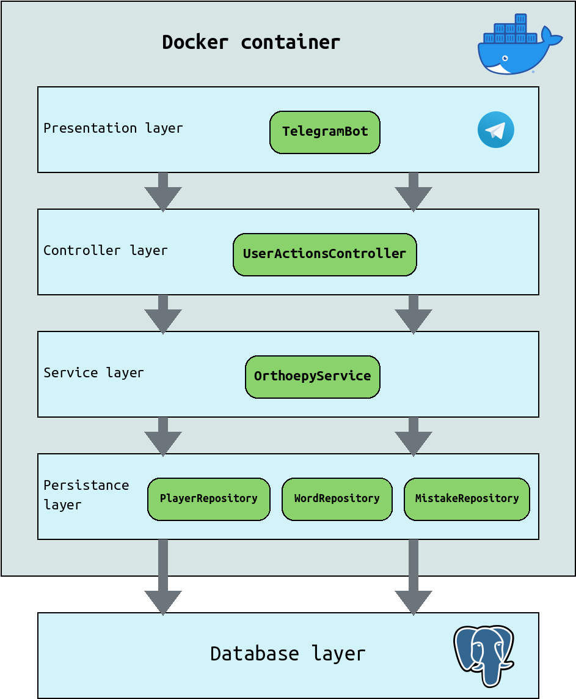
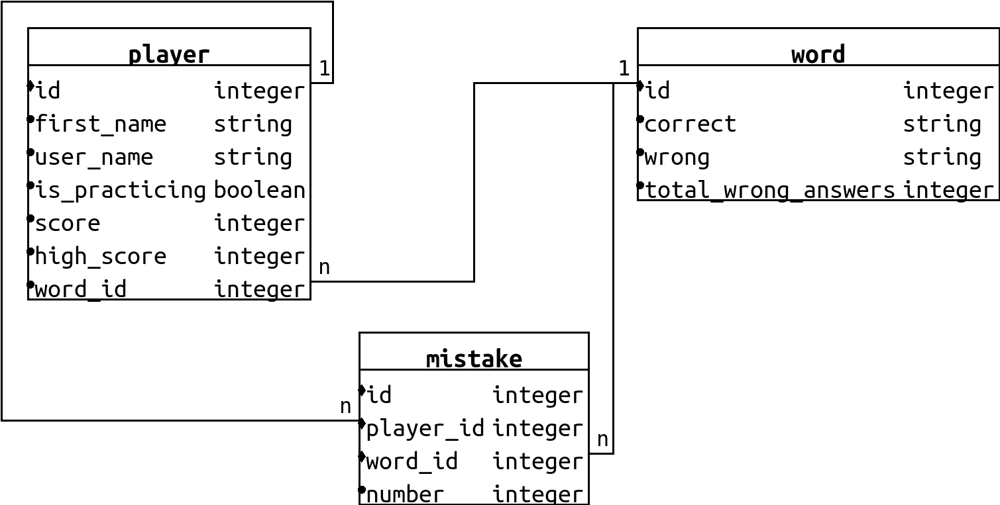

# OrthoepyBot

## Statement of problem

Students of last grades have troubles with practicing orthoepy section for Russian language RNE(EGE) because of no rule for stress placement. So orthoepy requires special approach: regular repetition. By experience, cramming 3 hundred boring words is not what you would like to do regularly.

## Solution

Make practicing process more *enjoyable*. It is achieved by using game-orienting approach. It includes:
* Imaginary value
* Competitive component
* Statistics gathering

### Imaginary value

Each wrong answer ends game flow.  So, If student answered, for example, more than 50 questions, he starts caring about scored points.

### Competitive component

If result would be compared to others, we make a greater effort. Therefor every bot user can see top 10 of best players.
 
### Statistics gathering

Be able to analyze your mistakes is cool. It helps to find out, where you have the gaps in knowledge.

## Technologies used:

  - Java 11
  - Spring (Boot, Core, Data, Test)
  - Hibernate
  - JUnit 5
  - Mockito  
  - Gradle    
  - Docker (docker-compose)
  - Postgres DB
  - Lombok
  - AssertJ
  - [TelegramBots](https://github.com/rubenlagus/TelegramBots)

## App layers



## Entities relations



## Create .env file

```
# Postgres (example for dev environment)
POSTGRES_ADDRESS=postgres
POSTGRES_PORT=5432
POSTGRES_DB=dev
POSTGRES_PASSWORD=postgres
POSTGRES_USER=postgres

# Telegram bot
BOT_API_TOKEN=
BOT_USERNAME=
BOT_CREATOR_ID=

# Other
LOGGING_LEVEL_ROOT=INFO
HIBERNATE_DDL_AUTO=validate
JPA_SHOW_SQL=false
```

## Run docker container

```
docker run -d --restart on-failure --env-file .env --name bot ekiauhce/orthoepy-bot:latest
```

## Or docker-compose (dev environment)

```
docker-compose up --build -d
```
